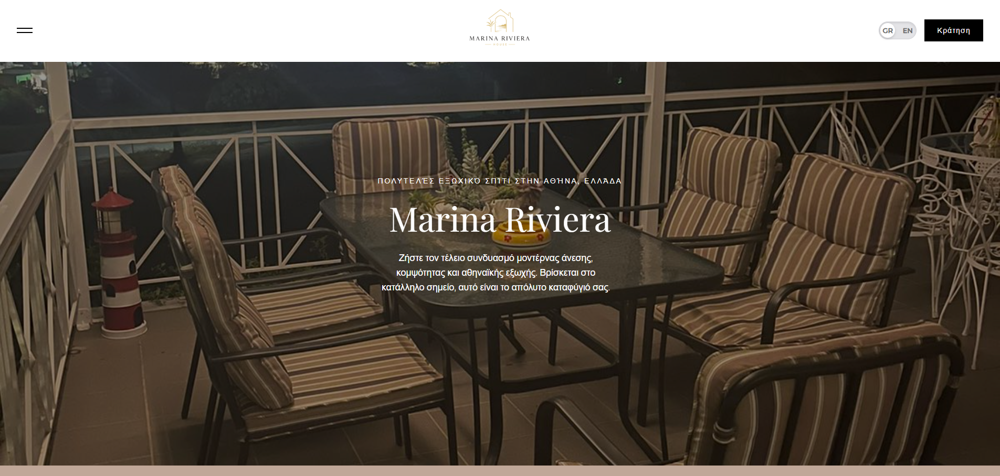
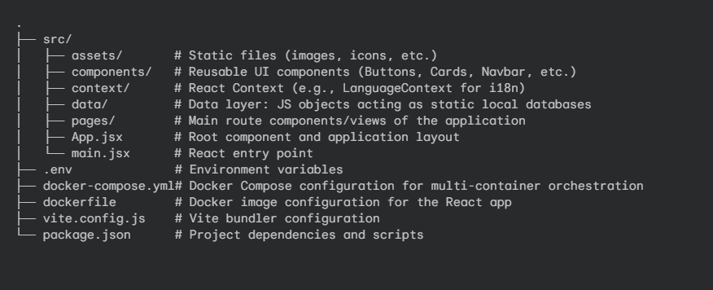

Airbnb Showcase Web App

A clean, responsive, and component-driven web application for showcasing an Airbnb property. Designed to provide visitors with detailed room highlights, amenities, location info, and an easy booking inquiry flow.

Built with React, powered by Vite, and fully containerized with Docker.

Live Demo

View Live Site

Preview

Tech Stack & Architecture

Frontend Framework: React (Functional Components & Hooks)

Build Tool: Vite (for Lightning-fast HMR and optimized builds)

State Management: React Context API (Custom Hooks for i18n)

Styling: CSS3 / Vanilla CSS 

Containerization: Docker & Docker Compose

Deployment: Vercel

Architecture & Data Flow

Data-Driven UI & Localization: The application's UI structure is decoupled from its content. Property details, gallery assets, and amenities are managed via structured JavaScript data modules in the /data directory. The app features full Multi-language support (i18n) handled globally using the React Context API, ensuring a scalable codebase ready for future API integration.

DevOps Ready: The project includes a Dockerfile and docker-compose.yml, ensuring a consistent and isolated development environment across different machines.

Project Structure

Key Features

Multi-Language Support (i18n): Seamlessly toggle between languages using Context API.

Dockerized: Ready to run in isolated containers for consistent development.

Fast Performance: Built with Vite for rapid development and optimized production builds.

Dynamic Component Rendering: UI dynamically generated from centralized data objects.

Fully Responsive Design: Seamless experience across desktop, tablet, and mobile viewports.

Getting Started (Local Development)

You can run this project either using standard Node.js/npm or via Docker.

Pre-requisites

Clone the repository:

git clone https://github.com/<your-username>/<your-repo-name>.git
cd <airbnb_project>

Environment Variables: Create a .env file in the root directory based on .env.example (if provided) or configure your local variables.

Option A: Running with Docker (Recommended)

Make sure you have Docker and Docker Desktop installed.

# Build and start the container
docker-compose up -d --build

# The app will be available at http://localhost:5173 (or your configured port)

Option B: Running with Node.js & Vite

# Install dependencies
npm install

# Start the local development server
npm run dev

Author

GitHub: @Anikolou

